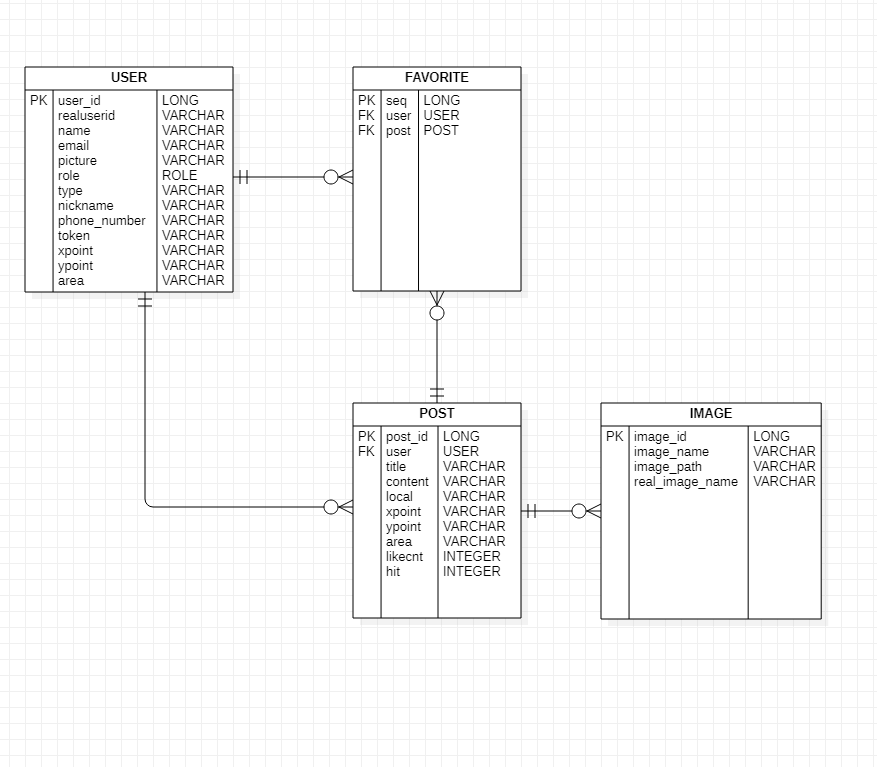

# food-travel Dashboard (최신화 2021/04/12)

### properties 파일을 잘못 커밋해 저장소를 초기화하였다...

### 주소

* www.food-travel.tk

### 음식여행기
- 음식 사진와 식당의 위치를 올려주어 가고싶었던 곳이나 재방문 의사가 있는 곳을 일기처럼 기록해두는 사이트.

- Spring Boot 와 Jsp 를 사용해서 구현하기.

### 구현
- 스프링 부트 시큐리티 O
  

- 스프링 부트 JPA ( MariaDB ) 사용
  

- SNS ( 카카오 , 구글 , 페이스북 , 네이버 ) 로그인 구현 O

- 카카오맵 API 구현 O
  

- 이미지 업로드 ( AWS S3 ) 구현 O

- 개인정보 암호화 구현 ( SEED 알고리즘 사용, 별도로 키 보관 ) O 

- HTTPS 구현 ( AWS ACM 사용 ) O
  

- AWS 배포 완료.

### ERD

### 아쉬운 점.

* 프론트 쪽의 지식이 다소 부족해 템플릿 예제를 사용해서 만든 것이 아쉽다.
    * 제이쿼리와 자바스크립트는 구글링을 통해 어느정도 해결 할 수 있었지만, CSS 와 HTML 태그면에서는 좀 아쉬웠다.
    * 백엔드 기능을 구현해야하는데, CSS 의 엉뚱한 곳에 꽂혀서 시간을 허비하는 경우가 많았다.
    * 모바일 웹 환경에서 아이폰과 안드로이드가 보여지는 상황이 달라서 그거에 따른 스크롤 이벤트를 어떻게 다르게 해줘야하는지에 막혔다.

* 처음으로 하는 개인 프로젝트다 보니 처음부터 끝까지 내가 설계하고 내가 구현해야하는 점이 어려웠다.
    * 이렇게 하는것이 맞는건지, 어떤 점이 더 나은지에 대한 질문을 어디다가 할 수 없으니 오로지 나의 의견으로만 해결을 해야하는게
    어려웠다.
